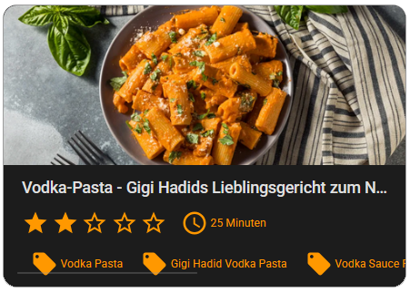
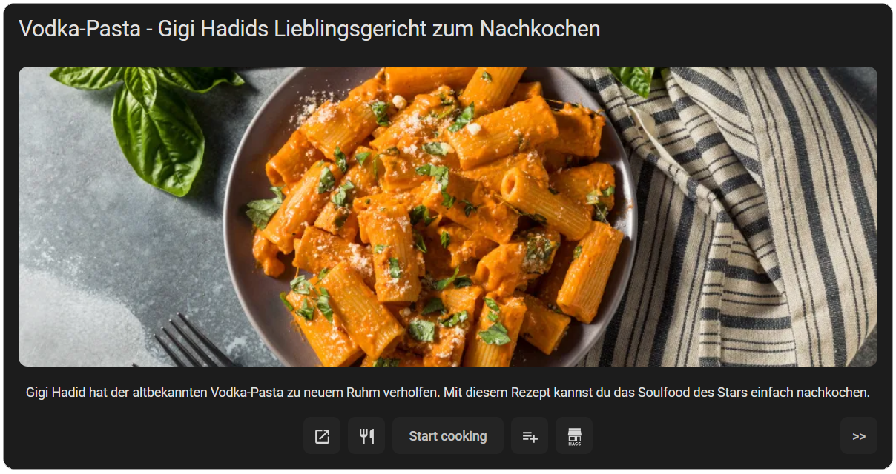

# Mealie Recipe Cards
A collection of cards to display a Recipe from Mealie.

Requieres a Mealie installation as well as a configured Mealie HA Integration.

## Cards

All cards support UI configuration.
To setup one of the cards you need:
- The mealie integration
- A Mealie Host url
- The ID of the recipe. You can get the ids of your recipes with the mealie.get_recipes service call.

### Mealie Recipe Card
A simple card to display a mealie recipe

Features:
- Simple display of the recipe
- Star rating
- Cooking duration
- Tags
- Automatically aligns to the Homeasistant layouting size

Perfect for a display with auto-entities-card

### Mealie Detail Card
A more detailed Card to display a recipe.

Features:
- Title page with shortcuts to mealie, original url
- Carousel style viewer for displaying ingredients and cooking
- Button to add all ingredients to a shopping list
- many design config options
- Custom configurable button and click actions
- mobile friendly
- popup friendly with Browser mod and Bubble Card
- Automatically aligns to the Homeasistant layouting size

## Installation

